## Información del Proyecto

- Autor: Esteban Aguilera Contreras
- Universidad: Escuela Colombiana de Ingeniería Julio Garavito
- Asignatura: Arquitecturas Empresariales (AREP)

---

## Despliegue con Docker

### 1. Compilar el proyecto

```bash
mvn package -DskipTests
```

### 2. Construir la imagen Docker

```bash
docker build -t arepwebserver -f .dockerfile .
```

### 3. Correr el contenedor

```bash
docker run -d -p 8080:35000 arepwebserver
```

El servidor queda disponible en `http://localhost:8080`. El puerto `35000` interno del contenedor se mapea al `8080` del host.

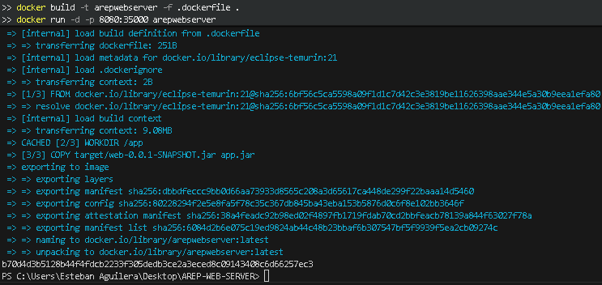

### Resultado

Página principal sirviendo el `index.html` con los endpoints disponibles:

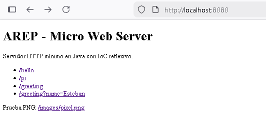

---

## Publicación en Docker Hub

### 1. Crear el repositorio en Docker Hub

Crear el repositorio público `arepwebserver` desde [hub.docker.com](https://hub.docker.com):

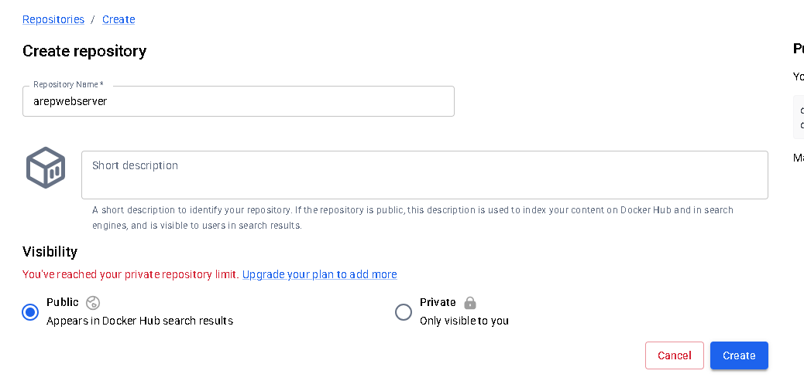

### 2. Etiquetar y subir la imagen

```bash
docker tag arepwebserver esteban0903/arepwebserver
docker login
docker push esteban0903/arepwebserver
```

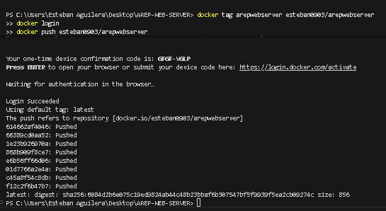

La imagen queda disponible públicamente en: `docker.io/esteban0903/arepwebserver`

Repositorio publicado en Docker Hub con el tag `latest`:

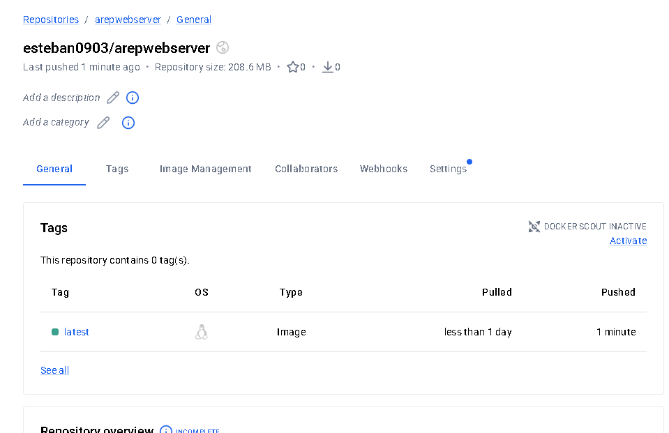

Para correrla desde cualquier máquina:

```bash
docker pull esteban0903/arepwebserver
docker run -d -p 8080:35000 esteban0903/arepwebserver
```

---

## Despliegue en AWS EC2

### 1. Lanzar instancia EC2

Se crea una instancia EC2 con Amazon Linux 2023.

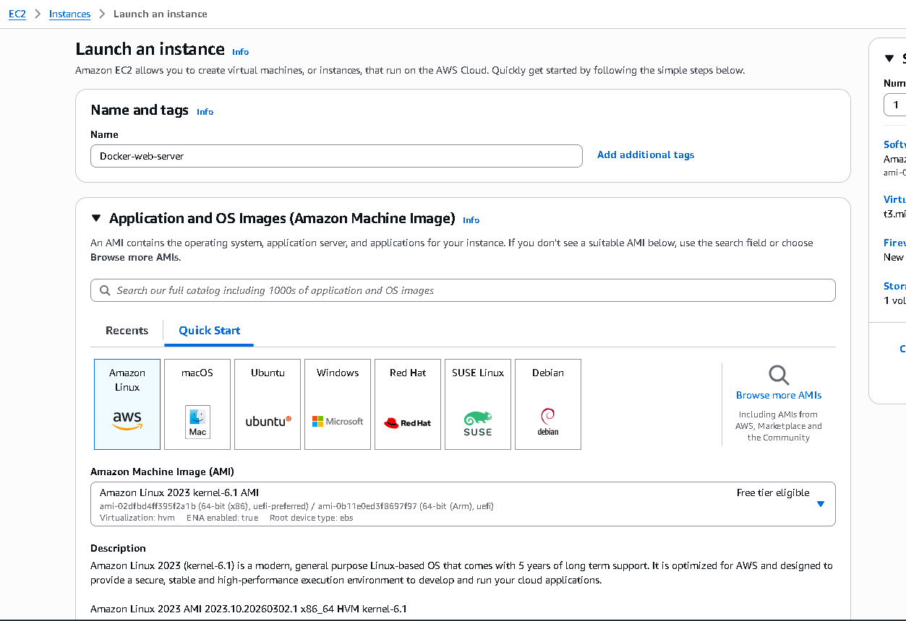

### 2. Instalar y habilitar Docker en la instancia

```bash
sudo yum update -y
sudo yum install docker -y
sudo service docker start
sudo usermod -a -G docker ec2-user
```

Evidencia de instalación y configuración de Docker:

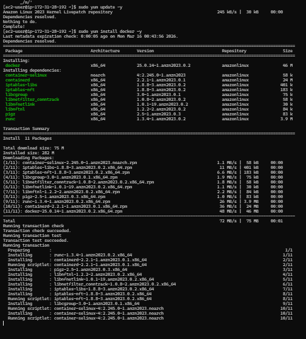

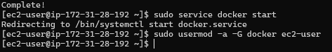

### 3. Ejecutar la imagen desde Docker Hub

Primero se cierra la sesion, se vuelve a ingresar por SSH y se valida que Docker quedo instalado correctamente:

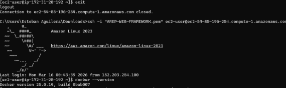

Luego se ejecuta el contenedor con el mapeo correcto de puertos:

```bash
docker run -d --name arepweb -p 42000:35000 esteban0903/arepwebserver
```

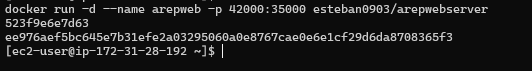

### 4. Configurar Security Group (Inbound Rules)

Agregar una regla de entrada:

- Type: Custom TCP
- Port range: 42000
- Source: 0.0.0.0/0

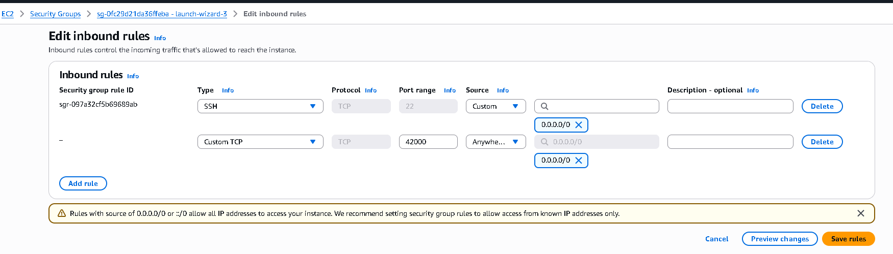

### 5. Verificar acceso público

Con la instancia en ejecución, Docker activo y la regla inbound configurada, la aplicación queda accesible desde:

```text
http://ec2-54-85-196-254.compute-1.amazonaws.com:42000
```

Instancia en estado running:

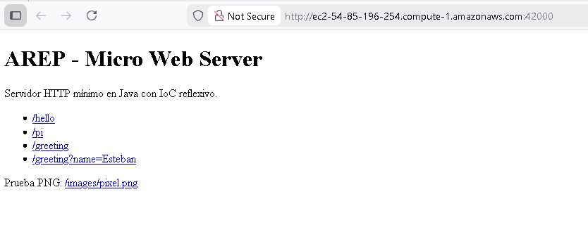

---

## Requisitos Técnicos

### Soporte de solicitudes concurrentes

El servidor procesa conexiones de manera concurrente mediante un pool de hilos fijo (`ExecutorService`), permitiendo atender multiples clientes al mismo tiempo sin bloquear el ciclo principal de aceptacion de sockets.

### Apagado elegante (graceful shutdown)

Se implementa un hook de runtime (`Runtime.getRuntime().addShutdownHook(...)`) que:

1. Marca el servidor en estado de apagado.
2. Cierra el `ServerSocket` de forma controlada.
3. Detiene el pool de workers esperando su finalizacion (`awaitTermination`) y forzando cierre si es necesario.

---

## Evidencia de Pruebas Automatizadas

Comando ejecutado:

```bash
mvn test
```

Resultado:

```text
Tests run: 6, Failures: 0, Errors: 0, Skipped: 0
BUILD SUCCESS
```