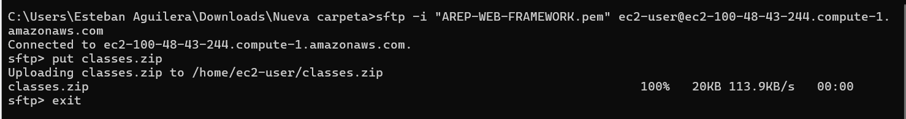
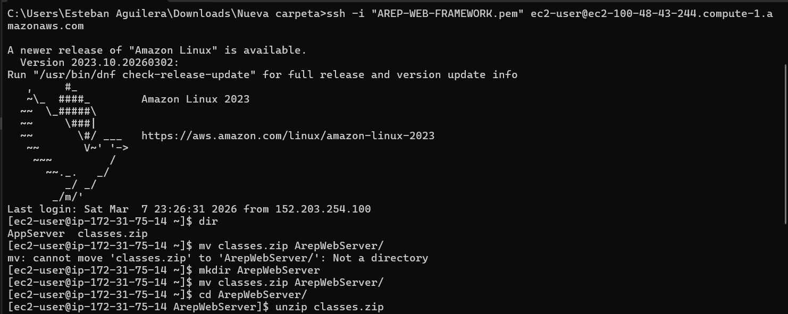
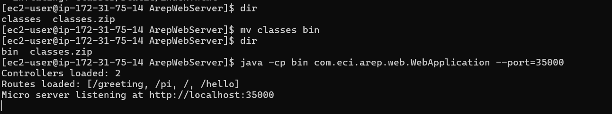
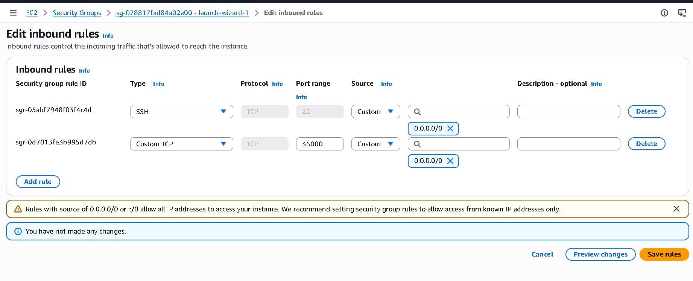
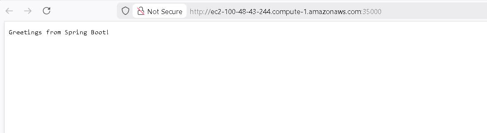
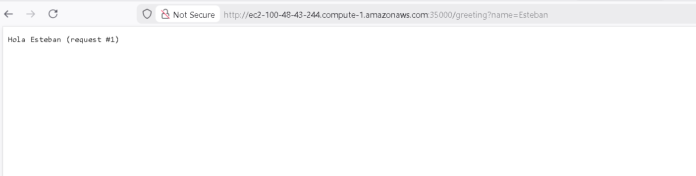
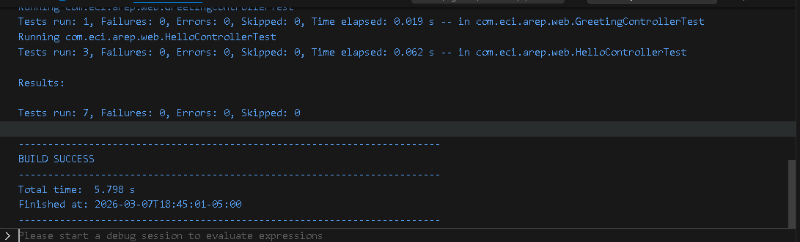

# AREP Web Server – Servidor HTTP + IoC reflexivo en Java

## Introducción

Este trabajo lo desarrollé como prototipo mínimo para el taller de AREP, con foco en dos objetivos:

- construir un servidor Web tipo Apache en Java (sin frameworks web de alto nivel), y
- demostrar capacidades reflexivas de Java para cargar POJOs anotados y publicarlos como servicios HTTP.

La solución atiende múltiples solicitudes **no concurrentes** y soporta recursos estáticos (`.html` y `.png`).

## Qué implementé

### 1. Servidor HTTP mínimo

- Servidor por `ServerSocket` en puerto `35000` (configurable con `--port=`).
- Soporte de método `GET`.
- Enrutamiento dinámico a métodos anotados.
- Respuesta de recursos estáticos desde `src/main/resources/static`.
- Tipos MIME soportados: `text/html`, `image/png`, `text/css`, `application/javascript`.

### 2. Framework IoC mínimo por reflexión

Anotaciones soportadas:

- `@RestController` para marcar componentes.
- `@GetMapping("/ruta")` para exponer endpoints.
- `@RequestParam(value = "x", defaultValue = "...")` para query params.

Capacidades:

- Carga explícita de POJO(s) por línea de comandos.
- Escaneo automático de clases en classpath para detectar `@RestController`.
- Invocación de métodos de instancia con retorno `String`.

### 3. Aplicación web de ejemplo

Se incluyen:

- `HelloController` con rutas `/`, `/hello`, `/pi`.
- `GreetingController` con ruta `/greeting` y soporte de `@RequestParam`.
- `index.html` de prueba para navegar endpoints.
- Imagen `pixel.png` para validar entrega de PNG.

## Estructura relevante

- `src/main/java/com/eci/arep/web/WebApplication.java`
- `src/main/java/com/eci/arep/web/RestController.java`
- `src/main/java/com/eci/arep/web/GetMapping.java`
- `src/main/java/com/eci/arep/web/RequestParam.java`
- `src/main/java/com/eci/arep/web/HelloController.java`
- `src/main/java/com/eci/arep/web/GreetingController.java`
- `src/main/resources/static/index.html`
- `src/main/resources/static/images/pixel.png`

## Requisitos

- Java 21
- Maven (o wrapper `mvnw`)

## Cómo lo corrí en mi máquina (Windows)

1. Compilé el proyecto:

```powershell
.\mvnw.cmd clean package
```

2. Ejecuté el servidor con escaneo automático:

```powershell
java -cp target/classes com.eci.arep.web.WebApplication
```

3. (Primera versión sugerida) También soporta carga explícita por clase:

```powershell
java -cp target/classes com.eci.arep.web.WebApplication com.eci.arep.web.HelloController
```

4. Probé en navegador:

- `http://localhost:35000/`
- `http://localhost:35000/hello`
- `http://localhost:35000/pi`
- `http://localhost:35000/greeting`
- `http://localhost:35000/greeting?name=Esteban`
- `http://localhost:35000/images/pixel.png`

## AWS EC2: Evidencia de despliegue

En esta sección explico el despliegue en orden, y debajo de cada paso dejo su evidencia.

### Paso 1. Subida del artefacto por SFTP

Luego subí `classes.zip` con `put`. Este comprimido ya contiene las clases compiladas.

```bash
sftp -i "AREP-WEB-FRAMEWORK.pem" ec2-user@ec2-100-48-43-244.compute-1.amazonaws.com
put classes.zip
exit
```



### Paso 2. Conexión por SSH y preparación (descompresión)

Después me conecté por SSH y en esa misma sesión preparé todo: creé carpeta, moví el comprimido, descomprimí y renombré `classes` a `bin`.

```bash
ssh -i "AREP-WEB-FRAMEWORK.pem" ec2-user@ec2-100-48-43-244.compute-1.amazonaws.com
mkdir ArepWebServer
mv classes.zip ArepWebServer/
cd ArepWebServer
unzip classes.zip
mv classes bin
```



### Paso 3. Ejecución del servidor en EC2

Con eso listo, inicié la aplicación en el puerto `35000`.

```bash
java -cp bin com.eci.arep.web.WebApplication --port=35000
```

Cuando sale `Micro server listening at http://localhost:35000`, el servidor quedó activo dentro de la instancia.



### Paso 4. Apertura de reglas en Security Group

Configuré reglas de entrada para que la aplicación fuera accesible desde internet:

- `Custom TCP (35000)` para el servidor web.



### Paso 5. Pruebas usando el Public DNS

Con el DNS público de la instancia validé que los endpoints respondieran correctamente:

- `http://ec2-100-48-43-244.compute-1.amazonaws.com:35000/`
- `http://ec2-100-48-43-244.compute-1.amazonaws.com:35000/greeting?name=Esteban`
- `http://ec2-100-48-43-244.compute-1.amazonaws.com:35000/images/pixel.png`

Prueba endpoint raíz (`/`):



Prueba endpoint con parámetro (`/greeting?name=Esteban`):



Prueba recurso estático PNG (`/images/pixel.png`):


## Evidencia de pruebas automatizadas

Para validar el comportamiento de controladores y anotaciones ejecuté los tests con Maven:

```bash
.\mvnw.cmd test
```

Resultado en consola (tests pasando):



## Conclusión

- El prototipo cumple el objetivo mínimo del taller: servidor web + IoC reflexivo con POJOs.
- Se soporta mapeo por anotaciones y parámetros de consulta con valor por defecto.
- Se entregan recursos estáticos HTML y PNG, más endpoints dinámicos de ejemplo.
- Como siguiente mejora, se puede extender a concurrencia, POST y escaneo más robusto para JARs.

## Información del Proyecto

- Autor: Esteban Aguilera Contreras
- Universidad: Escuela Colombiana de Ingeniería Julio Garavito
- Asignatura: Arquitecturas Empresariales (AREP)
